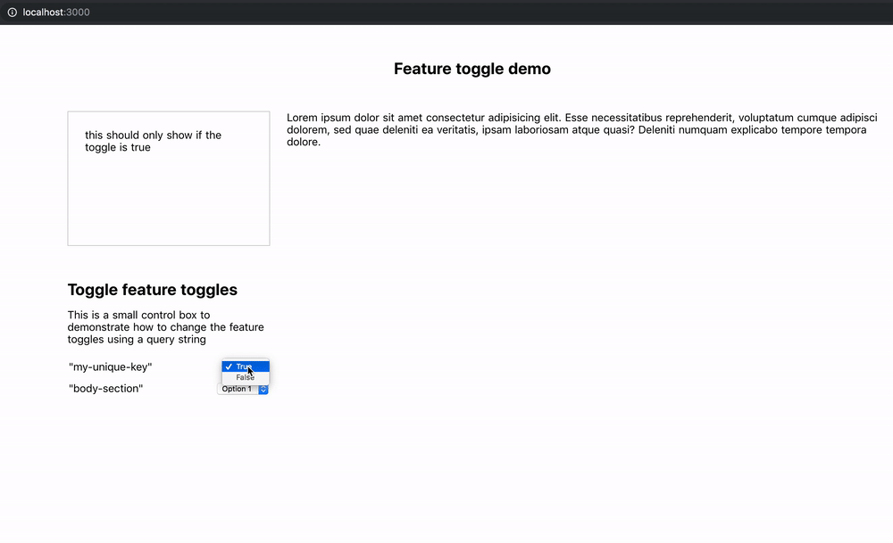

<h1 align="center">nuxt-feature-toggle</h1>
<p align="center">This is a simple module for Nuxt.js to add support for a feature toggle system.</p>

<p align="center">
  <a href="https://david-dm.org/stephenkr/nuxt-feature-toggle">
    
  </a>
  <a href="https://standardjs.com">
    
  </a>
  <a href="https://www.npmjs.com/package/nuxt-feature-toggle">
    
  </a>
  <br/>
  <a href="https://www.npmjs.com/package/nuxt-feature-toggle">
    
  </a>
  <a href="https://circleci.com/gh/stephenkr/nuxt-feature-toggle">
    
  </a>
</p>

<p align="center">
  <a href="./CHANGELOG.md">Release notes</a>
</p>

## Features
- Dynamically pull in your feature toggles when the application starts
- Set a static list of feature toggles
- Optional query string support to override a feature toggle

## Usage

### 1. Add module to nuxt.config.js along with the feature toggle options.

The toggles can be defined as a function or just as an object.

#### As a function
```
module.exports = {
  modules: ['nuxt-feature-toggle'],

  featureToggle: {
    toggles: () => {
      return Promise.resolve({
        'my-unique-key': true
      })
    }
  }
}
```

#### As an object
```
module.exports = {
  modules: ['nuxt-feature-toggle'],

  featureToggle: {
    toggles: {
      'my-unique-key': true
    }
  }
}
```

### 2. Use the feature toggle component

```
<feature-toggle name="my-unique-key" :value="true">
  <p>This can only show if the toggle is enabled</p>
</feature-toggle>
```

## Use with the query string

To use the query string with your feature toggles, first enable it in your configuration file.

```
module.exports = {
  modules: ['nuxt-feature-toggle'],

  featureToggle: {
    queryString: true,
    toggles: {
      'my-unique-key': true
    }
  }
}
```

The option `queryString` is used to enable query string support, so if the url contains a toggle query string, then the feature toggles with the matching value will be forced to show.

### Allowing access

You can control the access of the query string using a function, this can be defined using the following approach.

1. Create a new plugin file and import it into your nuxt.config.js file.

2. Add the following code to your new plugin

```
export default function({ $featureToggle }) {
  $featureToggle.isQueryStringAllowed(props => {
    return true;
  })
}
```

Here you can access the props for the feature toggle component, and you can access the context using the exported function.

If no function is defined, and the `queryString` option is true, then all query strings are allowed.

### Usage

Once the querystring options are setup, you can enter the following to change the feature toggle, ensure `toggle_` is prefixed to the name of the feature toggle.

```
https://website.com?toggle_my-unique-key=false
```

This will set the feature toggle 'my-unique-key' to false when viewing the page.

# To use the demo

1. Go to the `examples/demo` folder
2. Run the command `yarn`
3. Once done, run `yarn dev`
4. Navigate to `http://localhost:3000`

## About the demo

The demo will show how the query string functionality works with the feature toggles. You should see a control box on the left hand side where you can manipulate the query strings in the URL. This will update the feature toggle on the page.



# License

<a href="./LICENSE">MIT License</a>